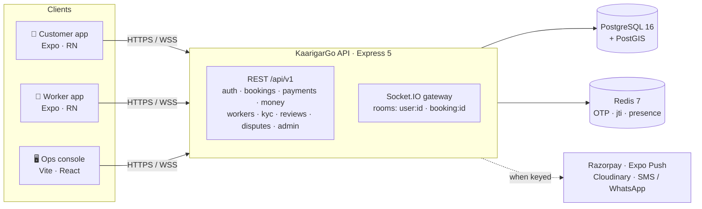
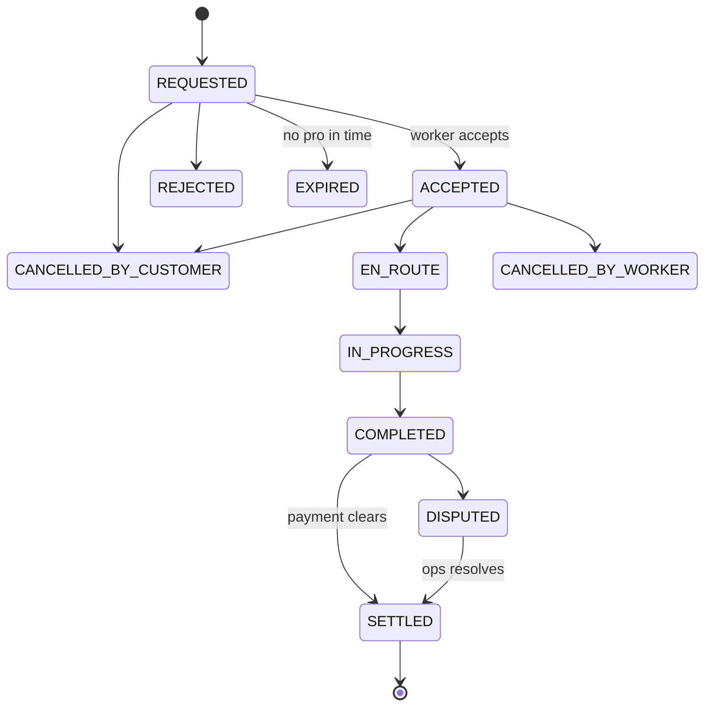
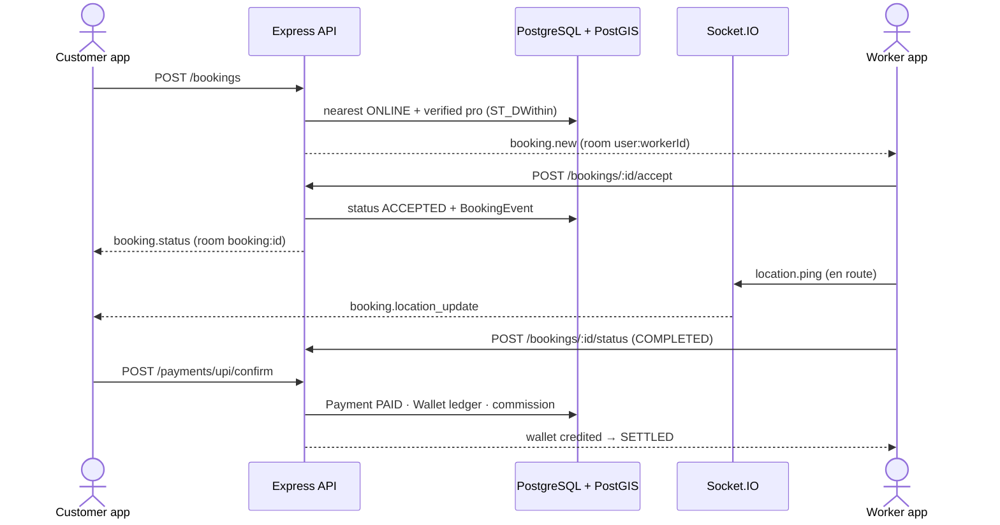
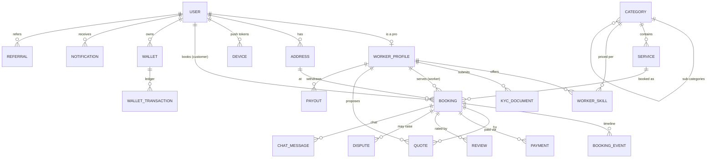

<div align="center">


# KaarigarGo

**An on-demand home-services marketplace for India — book a verified local pro (electrician, plumber, cleaner, carpenter…), track them live on a map, and pay by UPI or cash.**

One Express API serves **two** native mobile apps (customer + worker) and a web ops console — a real two-sided, real-time marketplace with an escrow-style money layer, built to run on free-tier infra.

<br/>


<br/>

🌐 **[Live API](https://kaarigargo-api.onrender.com/api/v1)** &nbsp;·&nbsp; ❤️ **[Health](https://kaarigargo-api.onrender.com/api/v1/health)** &nbsp;·&nbsp; 📚 **[Documentation](#-documentation)** &nbsp;·&nbsp; 🐛 **[Report a bug](https://github.com/samayjainbm/KaarigarGo/issues)** &nbsp;·&nbsp; ✨ **[Request a feature](https://github.com/samayjainbm/KaarigarGo/issues)**

</div>

---

## 📑 Table of Contents

- [Overview](#-overview)
- [Live & Demo](#-live--demo)
- [Features](#-features)
- [Tech Stack](#-tech-stack)
- [Architecture](#-architecture)
  - [System overview](#system-overview)
  - [Booking lifecycle](#booking-lifecycle)
  - [Request & data flow](#request--data-flow)
  - [Data model](#data-model)
  - [Folder structure](#folder-structure)
- [Security & Trust](#-security--trust)
- [Getting Started](#-getting-started)
- [Environment Variables](#-environment-variables)
- [API Reference](#-api-reference)
- [Realtime (Socket.IO)](#-realtime-socketio)
- [Documentation](#-documentation)
- [Deployment](#-deployment)
- [Roadmap & Honest Scope](#-roadmap--honest-scope)
- [Contributing](#-contributing)
- [License](#-license)

---

## 🧭 Overview

KaarigarGo connects **customers** who need a home service with nearby **workers** ("pros"). A customer books a job; the backend matches the nearest online, KYC-verified pro using a PostGIS radius search; the pro moves the job through a strict lifecycle (`accepted → en route → in progress → completed`); payment settles (UPI/cash) with a platform commission credited against the worker's append-only wallet ledger; both sides leave a verified review. **Ops staff** approve KYC, resolve disputes, and manage payouts from the web console.

The whole thing is deliberately lightweight — a **build-free plain-JavaScript** Express API with a single versioned JSON contract — so every client speaks the same `/api/v1` envelope and the same Socket.IO gateway, and the stack runs comfortably on free-tier hosting.

---

## 🎬 Live & Demo

| | |
| --- | --- |
| **Live API** | `https://kaarigargo-api.onrender.com/api/v1` |
| **Health check** | [`/api/v1/health`](https://kaarigargo-api.onrender.com/api/v1/health) |

Every response uses one envelope — `{ data, error, meta }`:

```bash
curl https://kaarigargo-api.onrender.com/api/v1/health
```

```json
{
  "data": { "status": "healthy", "db": "up", "redis": "up" },
  "error": null,
  "meta": null
}
```

> ℹ️ The API is hosted on Render's free tier, which sleeps after ~15 min idle — the **first** request after a nap can take 30–60 s (cold start). All clients tolerate this.

**Demo logins** — the dev OTP is returned in the API response and shown on-screen (no SMS provider needed):

| Client | Phone | Seeded as |
| --- | --- | --- |
| 📱 Customer app | `+919000000002` | Asha (`CUSTOMER`) |
| 🔧 Worker app | `+919000000003` | Ravi (`WORKER`) |
| 🖥️ Web ops console | `+919000000001` | `SUPER_ADMIN` |

---

## ✨ Features

| Feature | What it does | Why it matters |
| --- | --- | --- |
| 🔐 **Passwordless auth** | Phone-OTP login → JWT access + rotating refresh tokens, with Redis-backed revocation (`jti`) | No passwords to leak; sessions can be killed instantly on any device |
| 📍 **Geospatial matching** | Finds the nearest online + KYC-verified pro via PostGIS `ST_DWithin` / `ST_Distance` | The right pro reaches the customer fastest — the core of the marketplace |
| 🔁 **Booking state machine** | 11 states, forward-only worker transitions, full append-only event timeline | Jobs can't skip or reverse steps; every change is auditable |
| 💳 **Payments** | UPI-QR (zero-gateway), Razorpay (auto-enabled when keyed), idempotent HMAC-verified webhooks | Take money on day one with no gateway, upgrade to a real PSP by adding keys |
| 💰 **Money system** | Configurable commission rules, append-only wallet ledger, worker payouts | Every paisa is traceable with a running balance — escrow-style integrity |
| ⚡ **Real-time** | Socket.IO rooms for live status, location tracking, and in-booking chat | Customers watch their pro approach on a map, live |
| 🔔 **Notifications** | In-app feed + Expo push fan-out to registered devices | Both sides stay informed without polling |
| 🛡️ **Trust & safety** | Worker KYC, verified reviews, disputes, reliability scoring, in-app SOS | Keeps a two-sided marketplace safe and accountable |
| 🎁 **Growth** | Referral codes with two-sided wallet rewards | Built-in viral loop, settled through the same ledger |
| 🧑‍💼 **Admin console** | Analytics, user/worker/booking management, KYC & dispute queues, audit logs | Ops can run the whole marketplace from a browser |

---

## 🧰 Tech Stack

| Layer | Stack |
| --- | --- |
| **Backend** | Node ≥ 20, **Express 5**, plain JavaScript (no build step), **Zod 3**, `jsonwebtoken` 9, `qrcode` |
| **Data** | **PostgreSQL 16 + PostGIS 3.4**, **Prisma 6** (raw SQL for geography columns), **Redis 7** (`ioredis`) |
| **Realtime** | **Socket.IO 4.8** (rooms: `user:<id>`, `booking:<id>`) |
| **Mobile** | **React Native 0.76 / Expo SDK 52**, React Navigation 7, `expo-secure-store`, `expo-notifications`, `expo-location` |
| **Web (ops)** | **Vite 6 + React 19**, React Router 7, Tailwind CSS 3.4, `lucide-react`, `socket.io-client` |
| **Infra** | Docker (`node:22-alpine`), **Render** (API), **Vercel** (web), **EAS** (mobile), Supabase/Neon (Postgres), Upstash (Redis) |

---

## 🏗️ Architecture

The API is the single source of truth. Every client speaks the same `/api/v1` JSON envelope (`{ data, error, meta }`) and the same Socket.IO gateway. The backend is organized as **one router / service / schema module per domain**.

### System overview



### Booking lifecycle

Worker transitions are **forward-only** (`canWorkerTransition`); terminal states end the job.



### Request & data flow

A booking, end to end:



### Data model

18 tables in PostgreSQL. Money is stored in **integer minor units (paise)** — never floats. Geospatial columns use PostGIS `geography(Point, 4326)`.



> Also present: `CommissionRule` (global / category / worker-tier pricing) and `AuditLog` (before/after JSON of every admin action).

### Folder structure

```
KaarigarGo/
├── server/            # Express 5 API — one folder per domain (router + service + schemas)
│   ├── auth/  bookings/  payments/  money/  workers/  kyc/  reviews/
│   ├── disputes/  referrals/  chat/  notifications/  realtime/  admin/
│   ├── config/        # env (zod), prisma client, redis client
│   ├── lib/           # response envelope, asyncHandler, zod validate
│   ├── middleware/    # requireAuth / requireRoles, error handler
│   └── server.js      # HTTP + Socket.IO bootstrap
├── prisma/            # schema.prisma (PostGIS), migrations, seeds
├── mobile/
│   ├── customer/      # Expo app — book, track, pay, review, wallet
│   └── worker/        # Expo app — jobs, earnings, KYC, live location
├── web/               # Vite + React ops console (admin + customer-style views)
├── docs/              # Study guide, schema reference, build story, viva (HTML + PDF)
├── Dockerfile         # production API image (no build step)
├── render.yaml        # Render blueprint for the API
└── docker-compose.yml # local Postgres (PostGIS) + Redis
```

---

## 🔒 Security & Trust

| Area | How it works |
| --- | --- |
| **Auth** | Phone-OTP → short-lived JWT **access** + rotating **refresh** tokens; no passwords stored |
| **Session revocation** | Refresh-token `jti` tracked in Redis — logout (single or all devices) invalidates instantly |
| **Authorization** | `requireAuth` + `requireRoles(...)` middleware; four roles: `CUSTOMER`, `WORKER`, `OPS_ADMIN`, `SUPER_ADMIN` |
| **Input validation** | Every request body is parsed with a **Zod** schema before it reaches a service |
| **Webhooks** | Raw request body captured to verify **HMAC** signatures (idempotent — safe to retry) |
| **Money integrity** | Amounts in integer paise; wallet is an **append-only ledger** with a running balance |
| **Trust & safety** | Worker **KYC** review, **verified** reviews (tied to real bookings), disputes, reliability scoring, SOS |
| **Auditability** | `AuditLog` records actor + before/after JSON for admin actions |

> ⚠️ Demo-mode shortcuts (open CORS, dev OTP, mock payments) are documented in [Roadmap & Honest Scope](#-roadmap--honest-scope). Harden them before real users — checklist in [`DEPLOY.md`](DEPLOY.md) §6.

---

## 🚀 Getting Started

### Prerequisites

- **Node.js ≥ 20** (the API Docker image uses Node 22) — runs the API, web, and Expo tooling.
- **Docker Desktop** — the easiest way to run local PostgreSQL + PostGIS and Redis (`docker-compose.yml`).
- **A phone with Expo Go** or an Android emulator — to run the mobile apps. (For native release builds: **JDK 17** + Android SDK.)

### 1. Backend API

```bash
# from the repo root
docker compose up -d            # PostgreSQL (+PostGIS) on :5432 and Redis on :6379
cp .env.example .env            # then set JWT_ACCESS_SECRET / JWT_REFRESH_SECRET

npm install
npm run prisma:generate         # generate the Prisma client
npm run prisma:migrate          # apply migrations to the local DB
npm run db:seed                 # seed catalog + demo accounts (categories, services, users)

npm run dev                     # API on http://localhost:3000/api/v1  (node --watch)
```

Check it: `curl http://localhost:3000/api/v1/health` → `{ "data": { "status": "healthy", ... } }`.

<details>
<summary>All backend scripts (from <code>package.json</code>)</summary>

| Script | Does |
| --- | --- |
| `npm run dev` | Start the API with file-watch (`node --watch server/server.js`) |
| `npm start` | Start the API |
| `npm run prisma:generate` | Generate the Prisma client |
| `npm run prisma:migrate` | `prisma migrate dev` (local) |
| `npm run prisma:deploy` | `prisma migrate deploy` (prod/CI) |
| `npm run prisma:studio` | Open Prisma Studio |
| `npm run db:seed` | Seed catalog + demo accounts (`ts-node prisma/seed.ts`) |
| `npm run db:seed:history` | Backfill ~2 months of demo activity |
| `npm run db:reset` | Reset the database |
</details>

### 2. Mobile apps (Expo)

Two separate apps share an identical `src/` library; run whichever you need. They default to the live Render API via `app.json → extra.apiUrl`, so they work even without a local backend.

```bash
cd mobile/customer          # or:  cd mobile/worker
npm install
npx expo start              # press 'a' (Android), 'i' (iOS), or scan the QR with Expo Go
```

> Pointing the apps at a **local** API? `localhost` on a phone is the phone itself — set `app.json → extra.apiUrl` to your machine's LAN IP (`http://192.168.x.x:3000/api/v1`) or `http://10.0.2.2:3000/api/v1` for the Android emulator. See [`mobile/README.md`](mobile/README.md).

<details>
<summary>Native release APK (local build, Windows)</summary>

Each app is a prebuilt Expo project. To build an installable release APK locally:

```bash
cd mobile/customer/android       # or mobile/worker/android
./gradlew assembleRelease        # output: app/build/outputs/apk/release/app-release.apk
```

Requires **JDK 17** + Android SDK. The icon font (`ionicons.ttf`) is embedded under `android/app/src/main/assets/fonts/` (lowercase — Android asset lookup is case-sensitive) and `android/build.gradle` pins Kotlin `1.9.25`. Or build in the cloud with EAS (see [Deployment](#-deployment)).
</details>

### 3. Web ops console (Vite + React)

```bash
cd web
npm install
echo "VITE_API_URL=http://localhost:3000/api/v1" > .env.local
npm run dev                 # web on http://localhost:3001
```

---

## 🔑 Environment Variables

Copy [`.env.example`](.env.example) → `.env`. Only the core block is required for local dev; the rest enable production integrations.

| Variable | Required | Description |
| --- | --- | --- |
| `NODE_ENV` | no | `development` (default) / `production` |
| `PORT` | no | API port (default `3000`) |
| `DATABASE_URL` | **yes** | PostgreSQL + PostGIS connection string |
| `REDIS_URL` | no* | Redis URL (default `redis://localhost:6379`) — needed in practice for OTP / refresh / live tracking |
| `JWT_ACCESS_SECRET` | **yes (prod)** | Signs short-lived access tokens (unsafe dev default if unset) |
| `JWT_REFRESH_SECRET` | **yes (prod)** | Signs rotating refresh tokens (unsafe dev default if unset) |
| `JWT_ACCESS_TTL` | no | Access-token lifetime, seconds (default `900`) |
| `JWT_REFRESH_TTL` | no | Refresh-token lifetime, seconds (default `2592000`) |
| `RAZORPAY_KEY_ID` / `_SECRET` / `_WEBHOOK_SECRET` | no | When set, the payment provider auto-switches mock → Razorpay |
| `UPI_VPA` / `UPI_PAYEE_NAME` | no | UPI VPA + display name baked into the UPI-QR deep link |
| `GOOGLE_MAPS_API_KEY_*` | no | Maps keys (server / Android / iOS) |
| `FIREBASE_*`, `SMS_PROVIDER_KEY`, `WHATSAPP_API_KEY` | no | Notification / SMS providers (Expo push works without these) |
| `CLOUDINARY_*` | no | Media uploads |
| `SENTRY_DSN`, `POSTHOG_KEY` | no | Observability |

> **Never commit `.env`.** The `JWT_*` secrets fall back to `dev_*_change_me` defaults if unset — fine locally, unsafe in production.

---

## 🔌 API Reference

Base URL: `/api/v1`. All responses use the `{ data, error, meta }` envelope. 🔒 = requires a bearer token.

<details open>
<summary><b>Auth &amp; identity</b></summary>

| Method | Endpoint | Description |
| --- | --- | --- |
| `POST` | `/auth/otp/request` | Request a login OTP for a phone number |
| `POST` | `/auth/otp/verify` | Verify OTP → access + refresh tokens |
| `POST` | `/auth/refresh` | Rotate the refresh token |
| `POST` | `/auth/logout` | Revoke the current (or all) session(s) |
| `GET` | `/me` 🔒 | Current user profile |
| `PATCH` | `/me` 🔒 | Update profile |
| `POST` | `/me/devices` 🔒 | Register a device for push |
</details>

<details>
<summary><b>Catalog &amp; workers</b></summary>

| Method | Endpoint | Description |
| --- | --- | --- |
| `GET` | `/categories` · `/categories/:slug` | Service categories (tree) |
| `GET` | `/services` | Bookable services |
| `GET` | `/workers/search` | Geospatial search for nearby pros |
| `GET` | `/workers/:id` | Public worker profile |
| `POST` `PATCH` | `/worker/profile` 🔒 | Create / update worker profile |
| `GET` `POST` `DELETE` | `/worker/skills[/:id]` 🔒 | Manage priced skills |
</details>

<details>
<summary><b>Bookings, chat &amp; safety</b></summary>

| Method | Endpoint | Description |
| --- | --- | --- |
| `POST` `GET` | `/bookings` 🔒 | Create a booking / list yours |
| `GET` | `/bookings/:id` 🔒 | Booking detail + timeline |
| `POST` | `/bookings/:id/accept` · `/reject` 🔒 | Worker accepts / rejects |
| `POST` | `/bookings/:id/status` 🔒 | Advance the state machine |
| `POST` | `/bookings/:id/cancel` 🔒 | Cancel |
| `POST` | `/bookings/:id/quote` · `/quote/accept` 🔒 | Propose / accept a price quote |
| `POST` | `/bookings/:id/track` 🔒 | Push a live location ping |
| `POST` | `/bookings/:id/sos` 🔒 | Trigger in-app SOS |
| `GET` `POST` | `/bookings/:id/messages` 🔒 | In-booking chat |
| `POST` | `/bookings/:id/cash/confirm` 🔒 | Confirm a cash payment |
</details>

<details>
<summary><b>Payments, wallet &amp; payouts</b></summary>

| Method | Endpoint | Description |
| --- | --- | --- |
| `POST` | `/payments/order` | Create a payment order |
| `POST` | `/payments/upi/qr` · `/upi/confirm` | UPI-QR flow (zero gateway) |
| `POST` | `/payments/order/:orderId/mock-pay` | Mark a mock order paid (dev) |
| `POST` | `/payments/webhook` | Provider webhook (HMAC-verified) |
| `GET` | `/wallet` · `/wallet/transactions` 🔒 | Balance + ledger |
| `GET` | `/worker/earnings` · `/worker/payouts` 🔒 | Worker earnings & payout history |
| `POST` | `/worker/payouts/request` 🔒 | Request a payout |
</details>

<details>
<summary><b>Reviews, disputes &amp; referrals</b></summary>

| Method | Endpoint | Description |
| --- | --- | --- |
| `POST` | `/bookings/:id/review` 🔒 | Leave a verified review |
| `GET` | `/workers/:id/reviews` | A worker's reviews |
| `POST` | `/bookings/:id/dispute` 🔒 | Raise a dispute |
| `GET` | `/disputes/:id` 🔒 | Dispute detail |
| `GET` | `/referrals/me` 🔒 | Your referral code + status |
| `POST` | `/referrals/apply` 🔒 | Apply a referral code |
| `GET` `POST` | `/worker/kyc` 🔒 | Submit / view KYC documents |
</details>

<details>
<summary><b>Admin / ops</b> (<code>OPS_ADMIN</code> · <code>SUPER_ADMIN</code>)</summary>

| Method | Endpoint | Description |
| --- | --- | --- |
| `GET` | `/admin/analytics/overview` 🔒 | Marketplace KPIs |
| `GET` | `/admin/users` · `/workers` · `/bookings` · `/audit-logs` 🔒 | Management lists |
| `POST` | `/admin/users/:id/suspend` · `/reinstate` · `/role` 🔒 | User controls |
| `POST` | `/admin/workers/:id/feature` 🔒 | Feature a worker |
| `GET` `POST` | `/admin/kyc` · `/admin/kyc/:id/approve` · `/reject` 🔒 | KYC queue |
| `GET` `POST` | `/admin/disputes` · `/:id/assign` · `/:id/resolve` 🔒 | Dispute queue |
| `*` | `/admin/catalog/*` · `/admin/commission-rules` · `/admin/payouts/*` 🔒 | Catalog, commission & payout admin |
</details>

---

## 📡 Realtime (Socket.IO)

Clients authenticate, then join two room types — `user:<id>` (personal) and `booking:<id>` (per-job).

| Event | Direction | Purpose |
| --- | --- | --- |
| `ready` | server → client | Handshake complete, rooms joined |
| `booking.join` | client → server | Subscribe to a booking room |
| `location.ping` / `booking.location_update` | client ↔ server | Live worker location on the map |
| `booking.status` | server → client | Lifecycle transitions pushed live |
| `chat.send` / `chat.message` | client ↔ server | In-booking messages |
| `chat.read` / `chat.markRead` | client ↔ server | Read receipts |
| `presence.heartbeat` | client → server | Keep worker online/BUSY presence fresh |

---

## 📚 Documentation

Full written docs live in [`docs/`](docs/) (each as HTML + PDF):

| Doc | What's inside |
| --- | --- |
| 📘 [Developer Study Guide](docs/KaarigarGo-Study-Guide.pdf) | End-to-end walkthrough of the codebase, module by module |
| 🗄️ [Schema Reference](docs/KaarigarGo-Schema-Reference.pdf) | Every table, column, enum, and relationship explained |
| 📖 [The Build Story](docs/KaarigarGo-Build-Story.pdf) | Why the architecture is shaped the way it is — decisions & trade-offs |
| 🎓 [Project Viva Q&A](docs/KaarigarGo-Viva.pdf) | Anticipated questions with answers, for a project defense |

Deployment runbook: [`DEPLOY.md`](DEPLOY.md) · Mobile notes: [`mobile/README.md`](mobile/README.md).

---

## ☁️ Deployment

| Piece | Where | Config |
| --- | --- | --- |
| **API** | Render (Docker) | [`render.yaml`](render.yaml) + [`Dockerfile`](Dockerfile) — runs `prisma migrate deploy` on boot; health check `/api/v1/health` |
| **Database** | Supabase / Neon (Postgres + PostGIS) | `DATABASE_URL` (`sync: false` in Render) |
| **Redis** | Upstash (TLS `rediss://`) | `REDIS_URL` (`sync: false` in Render) |
| **Web** | Vercel (root dir `web/`) | [`web/vercel.json`](web/vercel.json) — set `VITE_API_URL` |
| **Mobile** | Expo EAS → Play / App stores | [`mobile/*/eas.json`](mobile/customer/eas.json) — `preview` (APK) / `production` profiles |

Full step-by-step: [`DEPLOY.md`](DEPLOY.md).

---

## 🗺️ Roadmap & Honest Scope

This is a **feature-complete demo** with deliberate, documented shortcuts so it runs at zero cost. Each is a one-line swap for production:

- [x] Two-sided marketplace, real-time tracking, wallet ledger, KYC, disputes, referrals
- [ ] **OTP** is returned in the API response (`devOtp`) — wire a real SMS sender and drop `devOtp`
- [ ] **Payments** default to mock / UPI-QR (trusts a manual "I've paid") — set `RAZORPAY_*` for a real gateway
- [ ] **CORS** is open (`origin: '*'`) — restrict to known client origins
- [ ] Real-time uses **in-memory** Socket.IO rooms — add the Redis adapter before scaling past one API instance

The production hardening checklist lives in [`DEPLOY.md`](DEPLOY.md) §6.

---

## 🤝 Contributing

This is a personal/portfolio project, but focused improvements are welcome:

1. **Fork** the repo and create a branch (`git checkout -b feat/thing`).
2. Keep PRs **small and focused** — one concern each.
3. Match the existing style (plain-JS API, one module per domain, Zod at the edges).
4. Open a PR describing **what** changed and **why**.

Found a bug or have an idea? [Open an issue](https://github.com/samayjainbm/KaarigarGo/issues).

---

## 📄 License

**Proprietary — UNLICENSED.** This repository is private (`"private": true`, `"license": "UNLICENSED"` in `package.json`); no usage rights are granted. © Samay Jain.

<div align="center">

Built by **Samay Jain** · [Report a bug](https://github.com/samayjainbm/KaarigarGo/issues) · [Live API](https://kaarigargo-api.onrender.com/api/v1/health)

</div>
